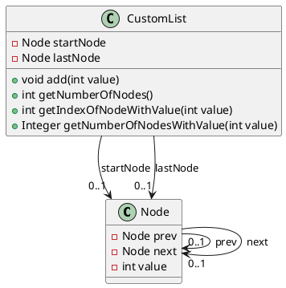

## Una implementación de lista 

Debe cubrir el siguiente UML

```plantuml

@startuml


class Node {
    - Node prev
    - Node next
    - int value
}

class CustomList {
    - Node startNode
    - Node lastNode
    + void add(int value)
    + int getNumberOfNodes()
    + int getIndexOfNodeWithValue(int value)
    + Integer getNumberOfNodesWithValue(int value)
}

CustomList  --> "0..1" Node :  startNode
CustomList  --> "0..1" Node :  lastNode

Node --> "0..1" Node : prev
Node --> "0..1" Node : next

@enduml
```

No se pueden usar ayúdas como copilot o chatGPT
